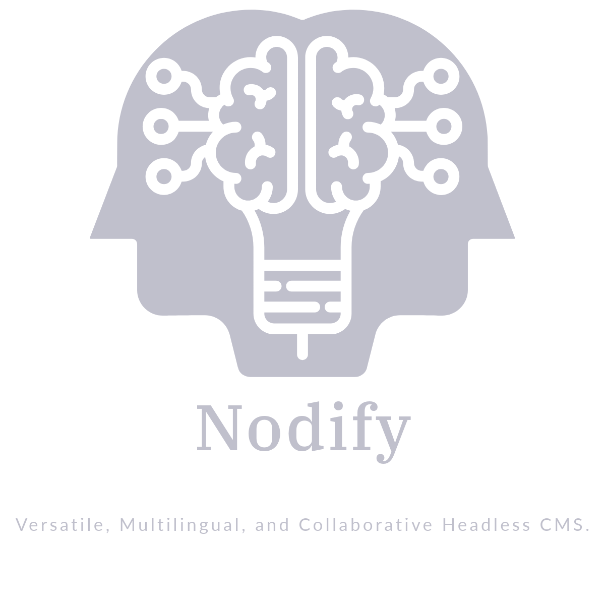

# Nodify Templates


A collection of templates for **Nodify Headless CMS**. These templates can be easily imported into Nodify to streamline your content management workflow.

## 🚀 About Nodify Headless CMS
[Nodify](https://github.com/AZIRARM/nodify) is a headless CMS that allows developers to manage and serve structured content through an API.

## 📦 What's Inside?
This repository contains ready-to-use templates designed to work seamlessly with Nodify CMS. These templates help you quickly set up your content structure without starting from scratch.

### 📝 Available Templates
- **[Blog](blogs/)** → Simple blog template.  
- **[Ebooks](ebooks/)** → Simple ebooks reader and organizer.  
- **[Gallery](gallery/)** → Simple portfolio / gallery template.  
- **[Landing Page](landingpages/)** → Simple landing page template.  
- **[E-Market](market/)** → Simple e-commerce template.  
- **[Music](music/)** → Simple music platform.  
- **[News](news/)** → Simple news template.  

## 🔧 How to Use
1. Import the desired template into your Nodify CMS instance.

## 📥 Importing Templates into Nodify
1. Log in to your Nodify CMS instance.
2. Navigate to the **Your Projects** section.
3. Upload the selected template file from this repository.
4. Save and deploy using the template in your project.

## 🤝 Contributing
We welcome contributions! If you have a useful template, feel free to submit a pull request.

## 📜 License
This project is licensed under the [MIT License](LICENSE).

---

💡 **Need help?** Open an issue or reach out to the [Nodify community](https://github.com/AZIRARM/nodify-templates/issues).
```
